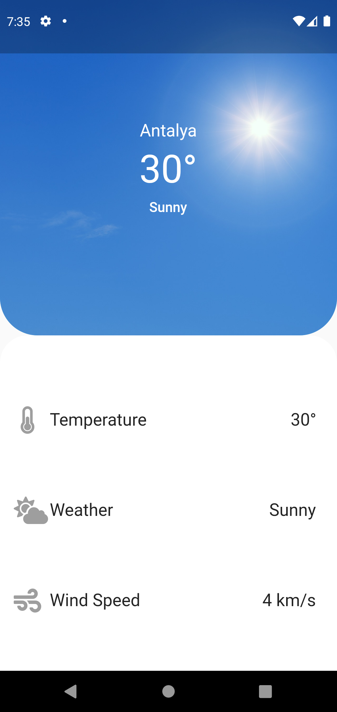

This is a weather app interface made using flutter. I could connect a weather database but I just wanted it to be an interface. If I want to publish it in appstore or playstore, I can edit it. 

  
  

